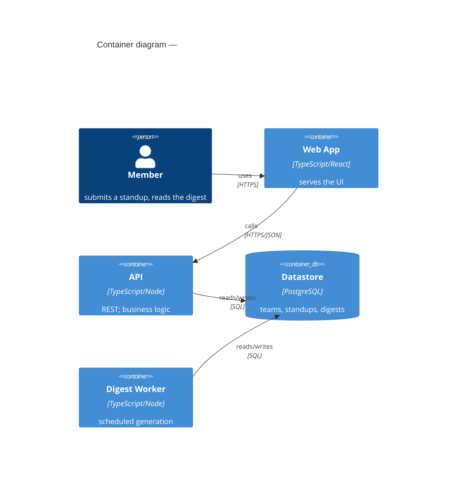

# System-architecture craft — the durable "shape" realization

> Loaded by skill 03, **mode `init`** (write `system.md`). How to turn `architecture-constraints.md` + the spine's
> domains + sprint-1 into a **lean** system shape a builder can follow and a reconciler can check. The concrete
> fill-in artifact is `templates/system.md` (it ships the arc42-subset skeleton + the seed crosscutting concepts +
> the banned-list); this file is the **method** and the **why**. The boundary it serves: the **stated
> `architecture-constraints` are the governed envelope**; the C4 shape, component decomposition, and internal data
> shapes are free realization — see `shared/spine-boundary.md` (repo-root-relative, per the framework's no-`../`
> rule). Reference REQs by ID; never copy REQ prose into the architecture.

## `system.md` is an arc42 subset, held to a lean-invariants discipline

Rather than C4 + a full DDD tactical model in an ad-hoc container, shape the **container**
to the **arc42 subset** — the de-facto documentation skeleton — and hold its content to BMAD v6.9's **lean-invariants
discipline** so it does not rot into verbose markdown no reviewer reads. The subset (the only sections `03` writes):

| arc42 § | Section | Filled by | Altitude discipline |
|---|---|---|---|
| §1 | **Constraints** | the stated `architecture-constraints` (referenced, not restated) | the governed envelope |
| §3 | **Context & Scope** | **C4 Level 1** (system boundary, actors, external systems) | load-bearing |
| §4 | **Solution Strategy** | the 3–5 decisions that shape everything (→ ADRs) | load-bearing |
| §5 | **Building Block View** | **C4 Level 2** (containers) + the **strategic-DDD bounded-context map** | load-bearing |
| §8 | **Crosscutting Concepts** | the house-style patterns (state · errors · eventing · security) **+ the banned-list** | seed |
| §9 | **Architectural Decisions** | a *pointer to* `adr/README.md` (the index is the single source — never duplicate) | — |
| §10 | **Quality Requirements** | measurable quality scenarios (below) | load-bearing |
| §11 | **Risks & Deferred** | the lean-invariants "deferred" list — what is intentionally not fixed yet | deferred |

**The lean-invariants rule (fix only what is load-bearing):** every fact in `system.md` is one of three —

- **load-bearing invariant** — changing it forces a cascade of rework (the context boundary, a bounded-context seam,
  a solution-strategy decision, a load-bearing quality scenario). **Fix these; they are the architecture.**
- **seed** — a starting value that will harden as the build teaches you (stack specifics within the envelope, a data
  shape). Mark it `seed` and move on — do not over-specify.
- **deferred** — a decision this slice does not need. Name it in §11 so it is *visibly* deferred, not silently
  missing. A silently-missing owned dimension is a reconciler finding (the breadth rubric, below).

Over-specifying seed/deferred detail is the failure mode (reviewer fatigue); under-specifying a load-bearing
invariant is the other. Aim the words at the load-bearing set.

## C4 — Mermaid canonical, ASCII fallback

C4 stays (it is maintained and notation-independent), but 2025 expects *diagrams as code*. Write **Mermaid**
`C4Context` (§3) and `C4Container` (§5) as the canonical form; keep an **ASCII fallback** for any harness that cannot
render Mermaid. Stop at **L1 + L2** — L3 (Component) and L4 (Code) are what feature specs and `src/` are for.

````

````

ASCII fallback conventions: `[Name]` for actors/containers, labelled one-direction arrows (`--HTTPS-->`), technology
on the container's second line. A **container table** is an acceptable substitute when the art gets unwieldy — keep
either form under ~30 lines and **label every arrow with its protocol** (an unlabelled edge is ambiguous).

## Strategic DDD is mandatory; tactical DDD is optional

The **strategic** layer is the boundary-finding backbone and is required: identify **bounded contexts** (areas with
a distinct ubiquitous language, a different rate of change, or different ownership) and draw the **context map** (the
relationships between them — `upstream/downstream`, `shared kernel`, `anti-corruption layer`). Contexts become the
§5 building blocks; the context map is what tells the reconciler where **strong/dynamic connascence crossing a
boundary** is a finding.

The **tactical** layer (entities · value objects · aggregates · domain events) is **optional** — model it only where
an aggregate's consistency boundary is load-bearing for this slice (e.g. "a Digest is generated once per team per
day" is an invariant worth an aggregate root). Pair discovery with Event Storming / Domain Storytelling if the
domain is unclear; do not produce a full tactical model as ceremony.

## §8 Crosscutting Concepts — the house-style (seed these, concretize per project)

Decide these **once**, project-wide, so every feature spec and every build inherits them rather than improvising.
They are *realization content the architect declares* **and** *anchors the reconciler cites* — a finding against
"the centralized-error-handling crosscutting concept" is anchored, not vibes. The seed set (from the consultancy
house-style; `templates/system.md` ships them as exemplars):

- **Functional core / imperative shell** — pure logic separated from side effects; **business logic never lives in a
  framework component or a controller**. A clean expression of the Dependency Rule.
- **Single immutable state store** — one place owns application state; updates are unidirectional (an `updateState()`
  + reducer), state is frozen, and a `state-changed` event fans out. Reducer logic is pure.
- **Centralized error handling** — every effect (I/O, network, DB) goes through **one** handler. "Error handling is
  required at every boundary where code meets the outside world." No scattered try/catch.
- **Event-based decoupling** — modules/components communicate by named events (payload in the event), **never by
  importing each other**. Keeps connascence low across boundaries.
- **Security posture** — where authN/authZ is enforced, where secrets live (`.env`, gitignored — never hardcoded),
  what is redacted from logs. Seed from the stated compliance mandates.

### The architecture banned-list (the AI-slop guardrails — the analogue of `02`'s design banned-list)

Ship an explicit banned-list in §8 so the build cannot drift into generic defaults, and so the reconciler has a
checkable anchor. Seed and extend per project:

- A **framework pulled in unless justified** by a stated need (the novelty-budget / Choose-Boring-Tech line).
- **Hardcoded secrets**; secrets anywhere but a gitignored `.env` / secret store.
- **`utils.js` / `helpers.js` dumping grounds**; **commented-out code** shipped.
- **Business logic in the imperative shell** (a controller/component doing domain work).
- **Scattered try/catch** instead of the centralized handler.
- **`innerHTML` with dynamic/user data** (XSS) and equivalent injection sinks.

The banned-list is the architecture analog of a lint config: it turns "don't produce slop" into rules a reviewer —
and a fitness function — can enforce.

## §10 Quality Requirements — measurable scenarios, not adjectives

Every quality attribute the architecture prioritizes is written as a **measurable arc42 quality scenario**, not an
`-ility` word. An unmeasured "-ility" is itself a reconciler finding. The scenario shape (source → stimulus →
artifact → response → **response-measure**):

> **Q-01 · Performance.** *When* a 12-person team's digest time is reached (**stimulus**, from REQ-008), *the digest
> worker* (**artifact**) generates and persists the day's digest (**response**) *within 5 seconds* (**response-measure**).

Pick attributes from **ISO/IEC 25010:2023** (functional suitability · performance efficiency · compatibility ·
interaction capability · reliability · security · maintainability · flexibility · safety) — but only the ones this
project actually prioritizes, each traced to a REQ or a stated constraint (the quantified NFRs 00 recorded in
`architecture-constraints.md`, coverage facet 7).

**Name the fitness function.** A scenario with a number is *enforceable* — so name the **executable check** that
enforces it, in the `Fitness function` column: a load-test command (`k6 run …`, `locust`), an ArchUnit-style
structural rule (`depcruise --validate …`), a conformance test (`pytest tests/arch/…`), or a health probe. Where no
runtime exists yet, carry `deferred: <why>` (Capability-Probe honesty — attempt, record, never silently skip). A
prose-only quality claim — a measure with no runnable check — is a reconciler finding, and 05 re-runs the named
functions at `final_commit` where a runtime exists. This is what turns evolutionary-architecture fitness functions
(Ford/Parsons/Kua) from an idea into a gate.

## § Test Strategy — the declared shape + a governed flake policy

`init` records a short **Test Strategy** the whole build inherits. **Core** (always): the **test shape** — pyramid /
trophy / honeycomb (Fowler) — chosen for *this* architecture with one line of rationale (a server-rendered app leans
trophy; a library leans pyramid), and a **flake policy** with teeth: a flaking test is **quarantined** with a
**ticket + owner + a fix-or-remove SLA** (default 2 weeks) + a re-qualification bar — never deleted or muted in
silence (>5 % flake collapses trust in the whole suite). **On-demand** (add when the trigger fires): **contract
tests** where services integrate over a network boundary, and **property-based tests** where a load-bearing invariant
exists (PBT kills ~50× the mutations of an average unit test). 04 places tests per the declared shape; 05 checks
conformance as advisory.

## § Threats considered — a ten-minute design-time threat pass (D6)

`init` walks the **Four Questions** (what are we building · what can go wrong · what do we do about it · did we do
enough) over the **C4 L1/L2 trust boundaries the diagram already draws** — STRIDE is an optional structuring aid, not
a mandate. Each threat gets a **mitigation**: a constraint line, an ADR, or an explicit **accepted-risk** note (a
threat with no mitigation is a reconciler finding). It is a pass, not a workshop — the boundaries are already on the
page, so it costs ten minutes. The payoff is downstream: **07's completeness lens cross-references it** — a designed
threat with no verifying check is a gap, and a 07 finding in a zone this pass called safe routes back as design
feedback. That converts 07's expensive BLOCK-on-architecture into a cheap design-time catch.

## The breadth rubric — a silently-owned dimension is a finding

Before the gate, sweep the **owned dimensions** an architecture must address and confirm each is either specified or
*visibly deferred* in §11. A dimension that is silently absent (not decided, not deferred) is a reconciler finding:

- data & persistence · API/interface style · authN/authZ · **the ops / deploy envelope** (where it runs, how it
  ships, region/residency) · observability (logs/metrics) · error & failure handling · scale/performance ·
  security · the crosscutting concepts above.

The **ops/deploy envelope** is the one most often dropped — name the deploy target, the region/residency, and the
run-shape (single node vs multiple stateless instances) explicitly, because those are exactly the facts a stated
constraint governs and the token-check grades.

## What "good" means — and what the eval deliberately does *not* grade

Aim the craft at a shape a builder can implement without guessing and a reconciler can check without taste. But
**architecture beauty is subjective and is *not* what the eval grades** — a strong builder also architects well. The
graded lift is **structural**: the arc42/C4/DDD shape *referencing REQs*, the MADR ADR registry + index, the
mechanically-gradeable Verification Contracts + coverage, and the token-checked amendment rows. Spend judgment on the
load-bearing invariants (the user lives with them); rely on structure for the contract the next skills consume. The
judgment layer that makes the *reconciler* reliable — the 11 review heuristics + the anchoring rule — lives in
`references/reconcile-architecture.md`.
