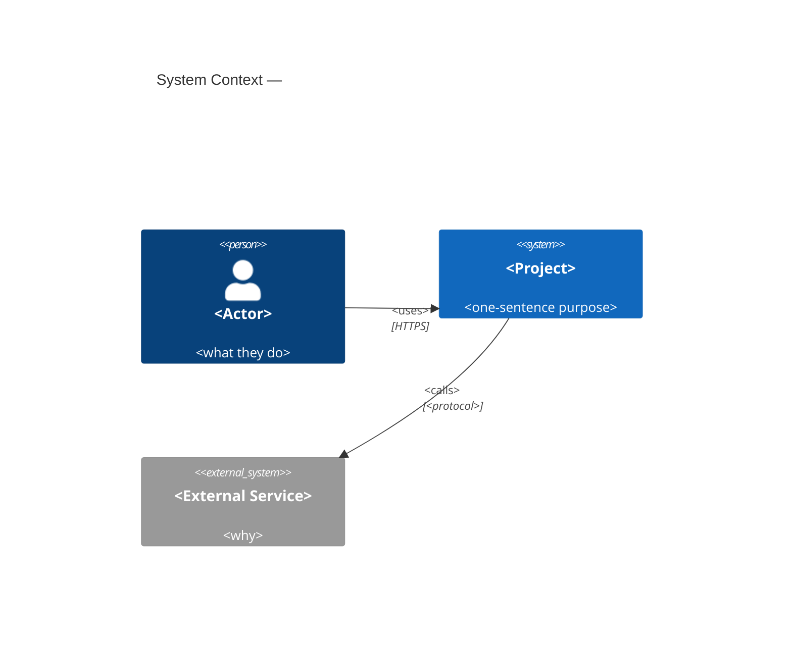
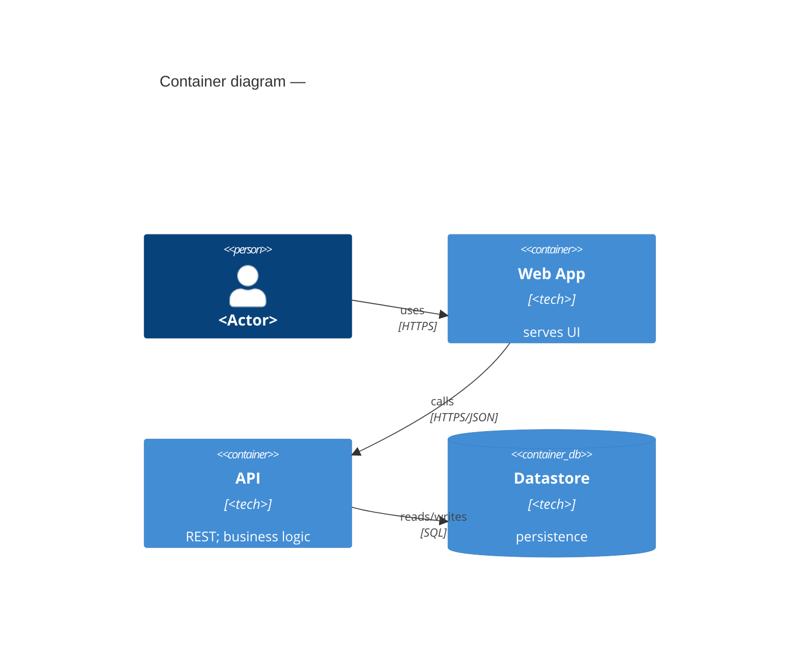

<!-- Filename: docs/architecture/system.md  (one per project; grows sprint over sprint). -->
<!-- budget: ≤250 lines — longer means restated methodology or copied spec prose; one home per fact. -->

# System Architecture — <Project Name>

> **The durable "shape" realization.** Owned by **skill 03 (architect)**. An **arc42 subset**, held to a
> **lean-invariants discipline** — fix only **load-bearing** invariants; mark starting values `seed` and un-needed
> decisions `deferred` (§11). It *references* `docs/spec/architecture-constraints.md` and the spine's REQs by ID — it
> never copies declaration prose. Craft method + the *why*: `references/system-architecture.md`. Diagrams: **Mermaid
> C4 canonical, ASCII fallback**; stop at L1 + L2.

**Realizes constraints from** `docs/spec/architecture-constraints.md` · **serves REQ-NNN, REQ-NNN, …** _(reference
IDs — never copy their prose)._

---

## §1 · Constraints (the governed envelope — referenced, not restated)

> The stated `architecture-constraints` this architecture must live inside. Link them; do not re-declare them. A
> realization that cannot honor one is a **Reconcile contradiction-flag** (`references/reconcile-architecture.md`).

| Constraint (from `architecture-constraints.md`) | Value | Honored by |
|---|---|---|
| Stack | _<e.g. TypeScript + Node — from constraints>_ | §5 |
| Datastore | _<e.g. PostgreSQL>_ | §5, ADR-NNN |
| Hosting / region / residency | _<e.g. EU region, single VPS via Docker>_ | §5, §8 security |
| Compliance / "no X" | _<e.g. magic-link only; no third-party SSO>_ | §8 security |
| Scale | _<e.g. ≤50 teams, ≤600 members>_ | §10 Q-NN |

---

## §3 · Context & Scope — C4 Level 1

> System boundary, actors, external systems. One-sentence system purpose. **Load-bearing.**

**Purpose:** _<one sentence: what this system does and for whom>._

````

````

<!-- ASCII fallback (use if the harness can't render Mermaid):
     [<Actor>] --HTTPS--> [<Project>: "purpose"] --<protocol>--> [<External Service>]
-->

---

## §4 · Solution Strategy — the 3–5 shaping decisions

> The handful of decisions everything else follows from (each → an ADR). **Load-bearing.** Keep it to the vital few.

| # | Decision | Why (driver / REQ / constraint) | ADR |
|---|----------|---------------------------------|-----|
| 1 | _<e.g. modular monolith + one scheduled worker>_ | _<driver>_ | ADR-NNN |
| 2 | _<e.g. REST/JSON over HTTPS>_ | _<driver>_ | ADR-NNN |

---

## §5 · Building Block View — C4 Level 2 + bounded contexts

> Containers (deployable units) **and** the **strategic-DDD bounded-context map** (mandatory). Tactical DDD
> (entities/aggregates) only where an aggregate's consistency boundary is load-bearing. **Load-bearing.**

### Containers

| Container | Technology | Responsibility | Communicates with (protocol) |
|-----------|-----------|----------------|------------------------------|
| _<Web App>_ | _<TS/React>_ | _<serves UI>_ | _<API (HTTPS/JSON)>_ |
| _<API>_ | _<TS/Node>_ | _<REST, business logic>_ | _<Datastore (SQL)>_ |
| _<Datastore>_ | _<PostgreSQL>_ | _<persistence>_ | — |

````

````

### Bounded-context map (strategic DDD — mandatory)

> Contexts = areas with a distinct ubiquitous language / rate of change / ownership. Name the relationships
> (`upstream → downstream`, `shared kernel`, `anti-corruption layer`). Strong/dynamic connascence crossing a context
> boundary is a reconciler finding.

| Bounded context | Ubiquitous language | Owns | Relationship |
|-----------------|---------------------|------|--------------|
| _<Identity>_ | _<member, magic-link, session>_ | _<auth>_ | _<upstream of Team>_ |
| _<Team>_ | _<team, invite, digest time>_ | _<membership, schedule>_ | _<upstream of Digest>_ |

<!-- Tactical (optional — only where load-bearing):
     Aggregate <Root> { invariant: "<the consistency rule, e.g. one Digest per team per day>" }
-->

---

## §8 · Crosscutting Concepts — the house-style (concretize; these are anchors)

> Decided **once**, project-wide — every feature spec and build inherits them. Each is realization content **and** an
> anchor the reconciler cites. Concretize the seeds below per project.

- **Functional core / imperative shell** — _<pure logic vs isolated side effects; business logic never in a
  component/controller>._
- **Single immutable state store** — _<one owner of app state; unidirectional `updateState()` + reducer; frozen
  state; `state-changed` event>._
- **Centralized error handling** — _<every effect through one handler; error handling at every outside-world
  boundary; no scattered try/catch>._
- **Event-based decoupling** — _<named events; payload in the event; modules never import each other>._
- **Security posture** — _<where authN/authZ is enforced; secrets in gitignored `.env`; what is redacted from logs —
  seeded from the stated compliance mandates>._

### Architecture banned-list (AI-slop guardrails — the reconciler & fitness functions enforce these)

- A framework pulled in **unless justified** by a stated need (novelty-budget / Choose-Boring-Tech).
- **Hardcoded secrets**; secrets anywhere but a gitignored `.env` / secret store.
- **`utils.js` / `helpers.js` dumping grounds**; **commented-out code** shipped.
- **Business logic in the imperative shell** (a controller/component doing domain work).
- **Scattered try/catch** instead of the centralized handler.
- **`innerHTML` with dynamic/user data** (XSS) and equivalent injection sinks.
- _<project-specific bans>._

---

## §9 · Architectural Decisions

> **The `adr/README.md` index is the single source** (and the `ADR-NNN` allocation source: next = `max + 1`). This
> section only **links** it — never duplicate the register here.

→ See [`adr/README.md`](adr/README.md) for the full ADR register. Load-bearing decisions this slice depends on:
ADR-001 (_<tech stack>_), _<…>_.

---

## §10 · Quality Requirements — measurable scenarios

> Each prioritized quality attribute (ISO/IEC 25010:2023) as a **measurable scenario** (source → stimulus → artifact
> → response → **response-measure**) that realizes a quantified NFR from `architecture-constraints.md`, **each naming
> its fitness function** — the executable check that verifies it (a command, a load-test script, an ArchUnit-style
> rule) — or carrying `deferred: <why>`. An unmeasured "-ility" **or a prose-only quality claim** (a measure with no
> runnable check) is a reconciler finding. 05 re-runs these at `final_commit` where a runtime exists. **Load-bearing.**

| Q-ID | Attribute | Scenario (stimulus → response → **measure**) | Fitness function (executable — or `deferred:<why>`) | Traces to |
|------|-----------|----------------------------------------------|-----------------------------------------------------|-----------|
| Q-01 | _<Performance>_ | _<when the digest time is reached, the worker generates the digest **within 5 s**>_ | _<`k6 run load/digest.js --vus 100` → p95 < 5 s>_ | REQ-008 |
| Q-02 | _<Security>_ | _<all data reads/writes stay **in the EU region**; no data leaves it>_ | _<`pytest tests/arch/test_region.py`>_ | constraint |

---

## § Test Strategy · `core` — the declared test shape + flake policy

> The **test shape** the build follows (04 places tests per it; 05 checks conformance — advisory) and the **flake
> policy** that keeps the suite trustworthy. **Core** = shape + flake SLA; contract-testing / PBT are `on-demand`.

- **Shape (`core`):** _<pyramid | trophy | honeycomb>_ — _<one line of rationale, e.g. "trophy: a server-rendered
  app, so integration tests carry the weight; a thin unit base, few E2E">_. (Fowler test-shapes.)
- **Flake policy (`core`):** a flaking test is **quarantined**, never deleted or muted silently — it needs a
  **ticket + owner + a fix-or-remove SLA (default 2 weeks)** + a re-qualification bar (N green runs) before it
  rejoins the gate. A quarantine with no ticket/owner/SLA is a reconciler finding. (>5 % flake = trust collapse.)

<!-- on-demand — add the row when its trigger fires:
  - **Contract testing** `on-demand(services integrate over a network boundary)` — a consumer-driven (Pact-style)
    contract pins the interface where <A> calls <B>; both sides run it in CI.
  - **Property-based testing** `on-demand(a load-bearing invariant exists)` — check <invariant> with generated
    inputs (PBT kills ~50× the mutations of an average unit test); seed the shrunk failing case as a regression.
-->

---

## § Threats considered · `core` — a design-time threat pass

> The **Four Questions** (what are we building · what can go wrong · what do we do about it · did we do enough) walked
> over the **C4 L1/L2 trust boundaries the diagram already draws** (STRIDE optional, a structuring aid — not a
> mandate). Each threat → a **mitigation**: a constraint line, an ADR, or an explicit **accepted-risk** note. A
> ten-minute pass, not a workshop. 07's audit cross-references this — a designed threat with no verifying check is a
> gap; a finding in a zone this pass called safe routes back as design feedback.

| Boundary (from §3/§5) | Threat (what can go wrong) | Mitigation (constraint / ADR / accepted-risk) |
|-----------------------|----------------------------|-----------------------------------------------|
| _<Browser → API>_ | _<session-token theft via XSS>_ | _<CSP + httpOnly cookies (ADR-NNN); §8 output-escaping>_ |
| _<API → Datastore>_ | _<injection at the query boundary>_ | _<parameterized queries only (§8 banned-list)>_ |
| _<System → External svc>_ | _<SSRF to internal metadata>_ | _<egress allowlist; or accepted-risk with a reason>_ |

---

## §11 · Risks & Deferred (the lean-invariants "not-yet" list)

> What is intentionally **not fixed** yet (so it is *visibly* deferred, not silently missing — a silent owned
> dimension is a reconciler finding). And the known risks.

- **Deferred:** _<decision this slice does not need — e.g. multi-region replication, caching layer>._ `deferred`
- **Seed (will harden):** _<a starting value expected to change — e.g. the exact table shapes>._ `seed`
- **Risk:** _<a decision a key scenario is sensitive to — ATAM risk>._
