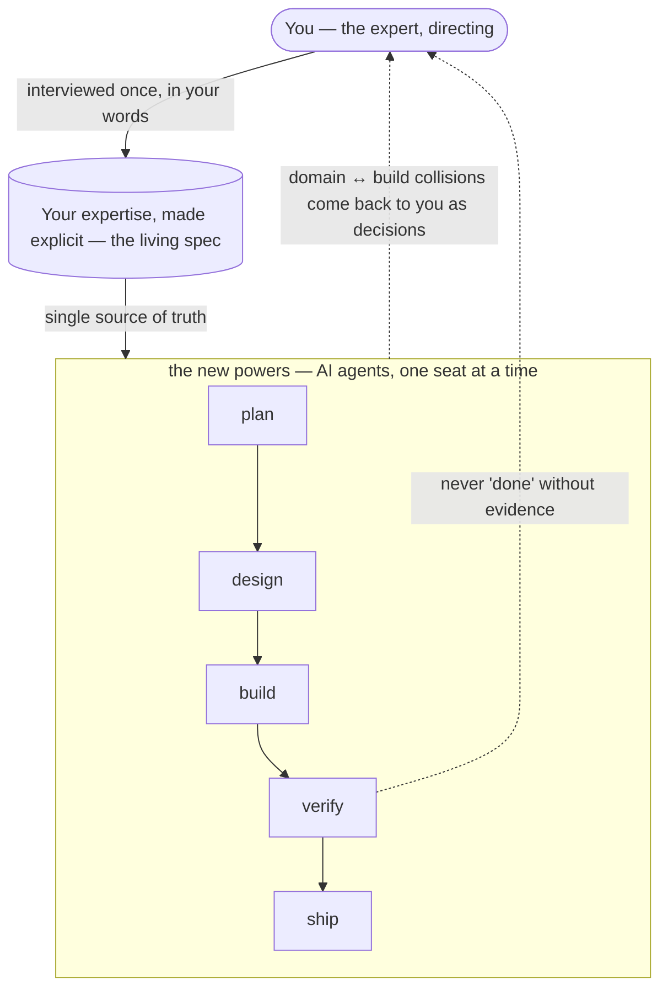

# Fullstack Director

> One person *directing* every role of the software lifecycle — discovery, planning, design, architecture,
> build, review, security, release — holding the entire system context, with zero handoff loss.

**You're an expert in your field — law, health, finance, anything.** AI just handed you the powers of an
entire software firm: strategist, designer, architect, builder, reviewer, security auditor. **Fullstack
Director organizes those new powers so you can direct them like a firm:** your expertise is interviewed and
written down as a living spec every seat must follow; every collision between your domain and the craft of
building comes back to you as a decision only you can make; and nothing is called "done" without evidence you
can read. You **direct in dialogue**; the AI workforce executes.



**Who this is for. Lawyer, fullstack. Social worker, fullstack. You, fullstack.** An engineer who can code
both ends of an app is called *fullstack* — why not you, in your own field? This framework is for domain
experts going into AI-assisted building who want the whole stack directed by their own expertise — and for
engineers who want a spec-first discipline their agents can't silently drift from. It runs inside the AI
coding tools you already use: **Claude Code · Codex CLI · Gemini CLI**.

## Quickstart

You need: one of the AI coding tools above, plus `git` and Python installed.

```bash
# 1 · Get the framework (once)
git clone https://github.com/IncommensurableHubris/fullstack-director

# 2 · Install the skills into your project folder (for a new project, make an empty folder first)
python fullstack-director/tools/vendor.py sync --target path/to/your-project

# 3 · Open your project in your AI tool and start
/00-discovery      # it interviews you, then writes your spec
/status            # anytime: where am I, what do I run next?
```

From there, `/status` always names the exact next command. The full walkthrough — what each step produces and
what you'll be asked to decide — is the [**Director's Guide**](docs/guide.md).

## Where your domain meets the build — the call is yours

Your spec is not a suggestion — when the craft of building collides with your domain's rules, the integrating
decision comes back to you. An illustrative run (a therapist building a practice app):

```text
▸ Designing "send session summary to client"…

⚠ Paused — this collides with a rule you set:
   REQ-007 · "Session notes are never sent by email"   (your confidentiality requirement)
   The summary feature, as requested, would email note content.

Your decision:
  [1] Secure-portal delivery — honors your confidentiality rule AND ships the feature
  [2] Amend the rule (recorded as your decision, in the log)

> 1
✓ Integrated: rule honored · feature redesigned · decision recorded
```

That pause is the framework's core mechanic — the **amendment protocol**: the build's craft and your domain's
rules both get a voice, and the integrating call is always yours, always logged. The same discipline runs at
review: work is not "done" until verification evidence exists.

## Why "Director"

The name comes from practice, not metaphor. The framework grew out of the **Fullstack Counsel** journey — a
practising lawyer building a legal-AI stack and finding that the decisive role is the **Director**: setting
intent, coordinating an AI workforce seat by seat, auditing the work — *directing in dialogue*. The thesis and
the journey are written up in [the Fullstack Counsel series](https://incommensurable.substack.com/); this
framework is that role built as a tool — for any domain expert, not only lawyers.

## Under the hood — four ideas

**Fullstack Director** is a spec-first, **cross-harness** SDLC skills framework. A single living **spec spine**
(`docs/spec/`) is the source of truth; functional-role skills each take "one verb on the spine," challenging and
refining it under a controlled amendment protocol rather than silently consuming or silently mutating it.

1. **Single source of truth.** One living spec spine (`docs/spec/`) holds the *declarations* (requirements, design
   intent, architecture constraints). There is no separate requirements brief or per-story files — the spine replaces them.
2. **Functional roles, no personas.** Each skill is one verb of the SDLC (specify, decompose, realize, build,
   verify, ship, secure) — clearer and field-aligned; character personas measurably tax correctness.
3. **Context-isolated verification.** A fresh-context reviewer (and an architecture reconciler) automate the
   manual session-reset otherwise done by hand, where the research says it pays.
4. **Living-spec amendment protocol.** Expert skills *challenge and improve* the spec under control — three tiers
   (auto-apply / gate / defer), escalate-when-uncertain, every amendment logged as structured evidence.

## Status

✅ **Complete and eval-verified.** All ten skills are built, each landing with its own deterministic eval suite —
`with_skill` vs no-skill baseline A/B arms, graders validated on real model output and required to *bite* (a
deliberately-wrong output must fail them) — plus a cross-skill integration chain. On top of the calibrated
harness, an **adversarial diagnostic track** (findings, never pass/fail) deliberately tries to make the skills
fail under pressure; its confirmed findings are fixed and the full records are published under
[`docs/eval-methodology/`](docs/eval-methodology/). Capabilities include the patch/expedite lane with standing
spine gates, EXPLORE and brownfield-ADOPT entry paths, the agentic Project Profile (agent contracts · eval-suite
acceptance · an agentic security panel), live-source verification for too-new tech, and the design-time
data-architecture discipline (datastore selection · retrieval · grounding · memory). A few conditional extensions
are deliberately built only on first need — recorded, with their triggers, in
[`shared/artifact-map.md` § Deferred activities](shared/artifact-map.md); the framework is complete without them.

**Packaging:** [`tools/vendor.py`](tools/vendor.py) deploys the framework into a consumer project in one command
for the three verified harnesses (Claude Code · Codex CLI · Gemini CLI — see
[`docs/harness-support.md`](docs/harness-support.md)), ships the `fsd-*` subagent definitions, and
[`shared/feedback-loop.md`](shared/feedback-loop.md) closes the dogfood→distill→upstream loop. This repo itself
deliberately commits no `.claude/skills` bridge — the SDLC chain runs in *consumer* repos only.

## Layout (target)

| Path | Role |
|------|------|
| [`docs/charter.md`](docs/charter.md) | **The framework's own declaration layer** — mission · non-negotiables C1–C14 · governance (user-gated) |
| [`docs/guide.md`](docs/guide.md) | **The Director's Guide** — the human-facing manual: onboarding (new + brownfield), the seats, the gates you hold |
| `docs/spec/` | The living spec spine — declaration-truth (Constitution + REQs by domain + design-intent + arch-constraints + amendment log) |
| `docs/planning/` | Backlog ledger + sprint slices — execution-truth |
| `shared/` | Shared cross-skill machinery — spine boundary, amendment & subagent protocols, and `artifact-map.md` (canonical storage + naming) |
| `.agents/skills/` | The functional-role skills (00 discovery → 07 security, + 08 refactor, + status) — the portable Agent Skills convention, auto-discovered across harnesses |
| `AGENTS.md` | Framework entry point — cross-harness instructions for driving the skills (Layer A) |
| `CLAUDE.md` | Claude Code bridge — imports `@AGENTS.md`, adds the methodology + governance-precedence layer |
| `docs/eval-methodology/` | Eval-harness pattern + reference copies of the proven runners/graders |
| `docs/harness-support.md` | Per-harness discovery paths + the manual deployment recipe |

## Non-goals

Deliberately out of scope — the framework targets **one director + AI agents**, not an org: multi-human team
ceremony (inter-person PR/branch conventions, standups); a hand-maintained requirements-traceability matrix (the
REQ-reference graph + `/status` integrity checks replace it); enterprise-scale threat modeling (PASTA) and formal
production-readiness reviews; and building any product inside this repo (Layer A is the framework, never a target).

## License

See [LICENSE](LICENSE).
