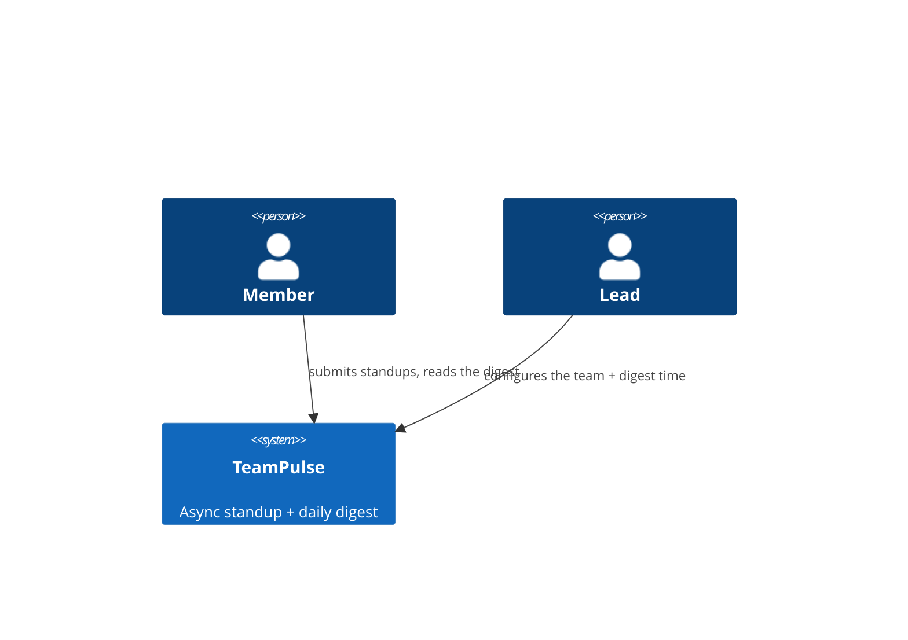

<!-- Filename: docs/architecture/system.md -->

# System Architecture — TeamPulse (sprint-01 walking skeleton)

> **The durable "shape" realization.** Owned by **skill 03 (architect)**. An arc42 subset; it *references* the
> spine's REQs by ID, never copying declaration prose. `04-builder` reads this as ambient context.

**Realizes constraints from** `docs/spec/architecture-constraints.md` · **serves REQ-007, REQ-004, REQ-006, REQ-005,
REQ-001, REQ-008** _(by ID)._

---

## §1 · Constraints (the governed envelope)

| Constraint | Value | Honored by |
|---|---|---|
| Language / runtime | TypeScript + Node (LTS ≥ 20) | §5 |
| Datastore | **PostgreSQL** (client-server, shared by all app instances + the worker) — amended from SQLite via **AMD-001** / **ADR-001** | §5, ADR-001 |
| Availability | ≥2 stateless web instances behind a load balancer + a separate always-on digest worker; all share one datastore | §5, §8 |
| Data residency | EU region only | §8 |
| Auth | email magic-link only — no passwords, no third-party SSO | §5 |

---

## §3 · Context & Scope — C4 Level 1

**Purpose:** Let a distributed team share and absorb daily status asynchronously — sign in, configure a team, submit
standups, and read one grouped daily digest.

---

## §5 · Building Block View — C4 Level 2

| Container / module | Technology | Responsibility |
|--------------------|-----------|----------------|
| web api | Node + TypeScript (≥2 stateless instances) | magic-link auth (REQ-007), team + invite (REQ-004/006), digest config (REQ-005), standup capture (REQ-001), digest read (REQ-008) |
| digest worker | Node + TypeScript (always-on) | generates one digest per team at the configured time (REQ-008) |
| datastore | **PostgreSQL** | the single shared store for teams, members, standups, digests |

### Bounded contexts

| Context | Ubiquitous language | Owns |
|---------|---------------------|------|
| Access | member, magic-link, team, invite, display name | identity + team membership (REQ-007, REQ-004, REQ-006) |
| Scheduling | team, digest time, timezone | the configured digest moment (REQ-005) |
| Standups | member, day, entry, needs-help | recording one entry per member/day (REQ-001) |
| Digest | digest, section, grouping | assembly of the daily artifact grouped by member (REQ-008) |

---

## §8 · Crosscutting Concepts

- **Shared client-server datastore.** Because the web tier is ≥2 stateless instances and the digest worker is a
  separate process, persistence must be a **shared client-server database** (PostgreSQL) — an embedded single-file
  store (SQLite) cannot be shared across processes/instances. This is the resolution of **AMD-001** (see ADR-001).
- **EU data residency.** All datastore instances are provisioned in the EU region.

### Banned-list (the reviewer & fitness functions enforce these)

- An embedded single-file datastore (SQLite) for shared state — violates the shared-store availability requirement.
- Any third-party SSO / password auth — magic-link only.

---

## §9 · Architectural Decisions

→ See [`adr/README.md`](adr/README.md). Load-bearing: **ADR-001** (PostgreSQL as the shared client-server datastore,
resolving the SQLite-vs-shared-store contradiction).

---

## §10 · Quality Requirements

| Q-ID | Attribute | Scenario (→ **measure**) | Traces to |
|------|-----------|--------------------------|-----------|
| Q-01 | Availability | no single point of failure in the web tier; ≥2 instances behind a load balancer | constraint |
| Q-02 | Legibility | the rendered digest reads top-to-bottom, needs-help first | REQ-008, REQ-009 |

---

## §11 · Risks & Deferred

- **Deferred:** "needs help" surfacing (REQ-009), past-digest read (REQ-010) — sprint 02. `deferred`
